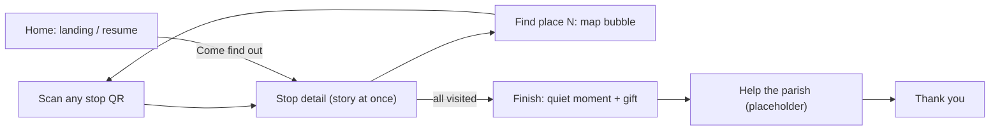

# Lakaw Katedral: Design Spec (Color, UX, Screens)

**Project:** Lakaw Katedral  
**Companion to:** [`SPEC.md`](./SPEC.md) (product and technical)  
**Status:** Accepted  
**Date:** 2026-10-06  
**Scope:** Mobile PWA visual system and screen UX for the MVP walk flow

This document is the source of truth for color tokens, chrome, and per-screen element inventory. Where it conflicts with older UI notes in `SPEC.md`, this document wins.

---

## 1. Design intent

Warm welcome for an outdoor QR walk through Naga Metropolitan Cathedral. Color should feel like standing in front of the cream facade at noon: grounded, inviting, readable in sun. Not a cool museum app, not a dark liturgy app, not a transit map.

**Inspiration:** cathedral facade (cream stone, wood doors, terracotta pavement, gold crest). Values are inspired for UI readability, not eyedropped from a photo.

---

## 1.1 Language

Plain words around real names. Visitor-facing copy is about Grade 3 level ("place" not "stop", "walk" not "journey", "give" and "help" not "donate" and "support"), but names and key terms stay exact: Naga Metropolitan Cathedral, Archdiocese of Cáceres, parish, façade, and so on, each explained in simple words the first time. Full rules: [`SPEC.md` section 3.1](./SPEC.md). Internal docs and code keep the words stop, POI and journey.

---

## 2. Color system

### 2.1 Decisions

| Decision | Choice |
|----------|--------|
| Appearance | Light only. No dark mode. |
| Neutrals | Soft cream canvas. Kill cool blue-gray backgrounds. |
| Primary CTA | Mid-brick terracotta. |
| Secondary | Wood brown (nav weight, secondary actions, visited tone). |
| Gold | Ceremonial only (completed journey moments, crest-like highlights). Never primary buttons. |
| Success | Muted green only (arrived / done). |
| Danger | Clear red (errors). Must not look like a CTA. |
| Sky blue | Banned from chrome. Do not reintroduce teal or cool blue accents. |

### 2.2 Token table

Implement in `src/app/globals.css` (`:root`). Keep `manifest.ts` / viewport `themeColor` in sync (terracotta or cream, not teal).

| Role | Token | Hex | Use |
|------|-------|-----|-----|
| Canvas | `--background` | `#f4eee4` | App background |
| Sheet | `--surface` | `#faf6ef` | Interactive panels only |
| Ink | `--foreground` | `#2a211c` | Primary text |
| Quiet ink | `--muted-fg` | `#6b5e54` | Secondary text |
| Line | `--border` | `#e0d4c4` | Dividers |
| Muted | `--muted` | `#9a8b7c` | Disabled / placeholder tone |
| CTA | `--accent` | `#b85c38` | Primary buttons, key actions |
| On CTA | `--accent-fg` | `#fffaf5` | Text on terracotta |
| Wood | `--stone` | `#6b4a35` | Secondary actions, nav weight |
| Wood soft | `--stone-light` | `#e8d8c8` | Soft chips, progress track |
| Gold | `--ceremonial` | `#c4a35a` | Completed / crest moments only |
| Success | `--success` | `#4f6b4a` | Arrived / done |
| Danger | `--danger` | `#b33b2e` | Errors only |

Legacy teal (`#0f5c5c`) and cool gray neutrals are retired.

### 2.3 Surfaces

- Default world is flat cream (`--background`).
- Use lighter ivory sheets (`--surface`) only when an interactive panel needs a container.
- No white card grids. No card treatment in heroes.

### 2.4 Contrast

Aim for WCAG AA on text and CTAs. Prefer mid-brick terracotta over muted clay so primary actions stay readable outdoors.

---

## 3. Chrome and navigation

| Rule | Choice |
|------|--------|
| Tab bar | None |
| Persistent chrome | Progress ring on the map chat-head beside the main CTA. Finish shows a full progress bar. |
| Map access | After the walk has begun (not on Home) |
| Home role | Resume hub (see screens) |
| Back | In-screen secondary actions only. No universal back chevron required for MVP. |

---

## 4. Flow principles

1. **Order is a suggestion:** any stop shows its full story and counts. Out-of-order visits get a one-line note, never a block.
2. **Scan is the start:** the entrance QR opens stop 1 directly. No Start tap, no redirect.
3. **"Find place N" is wayfinding, not navigation:** it opens the sheet with a plain-words landmark and the floor plan. It never opens the next story.
4. **Finish, then what is next, then the ask:** thank the walker first, then a quiet reflection, then the gift.
5. **Offline:** the whole tour is cached when the service worker installs. Donate needs network. No offline payment queue in MVP.
6. **Start over:** allowed from Home and from Finish (below the donate button), with confirm before clearing progress.

---

## 5. Screen inventory

### 5.1 Home (`/`): landing and resume hub

Not a required step on site (the entrance QR goes straight to stop 1). Used by people who arrive from a link, and as the resume point. Shows only the hero until saved progress is read, so a returning visitor never sees "Come find out" flash.

**Fresh visit**

- Quiet steward credit, upper left: Archdiocese of Cáceres crest beside the name. No floating badge, no pill chip.
- Brand: Lakaw Katedral as hero-level signal, over a full-bleed photo from the top edge of the screen (no card, no rounded corners)
- Hook: "Welcome, dear pilgrim and visitor."
- Fact first (interest pull): a living story of faith; more than four centuries at the heart of Bicol
- Invite: "Discover the heritage. Encounter the saints. Meet Christ." (no question stack)
- No cathedral-name headline, no QR mention
- Dock: **Come find out** opens place 1 immediately. The map chat-head never appears on Home.
- No stop list, schedule, stats, or address block in the first viewport

**In progress**

- Brand quieter; "Your next stop is {title}"
- Dock: map chat-head + **Find place N**
- Quiet destructive: Start over (confirm, then clear journey)

**Complete**

- Dock: map chat-head + **Help the parish** (to Finish)
- Quiet destructive: Start over

### 5.2 First-stop QR (`/s/saints`)

- Same as any stop. Scanning it starts the journey. No redirect, no Start tap.

### 5.3 Stop detail (`/s/[slug]`)

The story is static and renders immediately. The banner and dock appear once the visit is recorded.

Top to bottom:

1. Full-bleed photo across the screen, from the top edge (no card, no rounded corners)
2. Optional one-line note (out of suggested order, or journey complete)
3. Stop title
4. About (what is here; descriptive only, no instructions)
5. Dark card: **Something to do** (instruction / call to action: pray, look, pause)
6. Interesting fact
7. Dock: map button (progress ring) + **Find place N**, or **Finish** when all stops are visited

MVP: no audio, share, or save.

### 5.4 Wayfinding map (chat bubble)

- Circular **Map** chat-head beside the primary CTA (Messenger-style) on journey screens only. **Never on Home.**
- Progress `done/total` and ring fill live on the circle
- Fresh start (Home): **Come find out** opens place 1 immediately.
- On journey screens: tap the map chat-head **or** **Find place N** to open a tall map panel (rounded, height from dock up to the top safe area):
  1. Next stop card: stop number, title, **landmark** in plain words, "Scan the QR code there to read the story."
  2. Floor plan (completed / here / next)
- Dock stays visible under the bubble (backdrop stops above the dock)
- `/map` is a deep-link fallback that opens the same bubble
- **Trial mode only:** a dashed "Skip the scan: open place N" button at the bottom (also before the walk has begun, for desktop testing). Controlled by `NEXT_PUBLIC_ALLOW_SKIP`; remove for launch.

### 5.5 Finish (`/finish`)

Order, top to bottom. Hierarchy is reward first, then what is next, then the ask:

1. Full progress bar
2. **Reward (hero of the screen):** success check mark, "Thank you for walking with us", places count + time. This is the emotional peak.
3. **Before you go (secondary):** compact quiet-moment card with a short prayer photo strip; sit, candle, or prayer. Not the visual focus.
4. **Help the parish** inline (custom amount only, no preset chips; placeholder for now)
5. **Start over** below the donate button (confirm, then back to Home)

No stop checklist: progress already says all places are done. No "Not now" button: leaving is simply leaving. If the walk is not finished, the page says so and links back instead of showing the ending.

### 5.6 Donate (`/donate`)

- Redirects to `/finish`. Kept for old links and analytics paths.

### 5.7 Thank you (`/thank-you`)

- Warm confirmation
- Receipt-when-live copy only (no fake receipt UI)
- Home + Map

### 5.8 Out-of-order visit

- Full story, always. Order is a suggestion.
- One-line note: "Place N is next on the path. But you can see the places in any order. Enjoy this one!"
- Dock "Find place N" points at the lowest unvisited stop.

### 5.9 Completed re-visit

- Full stop replay
- Slim banner: "You finished the walk." with link to Finish
- No blocking modal every time

### 5.10 Offline (`/~offline`)

- Shown only if a page was never cached (for example, a very first visit with no signal)
- Title "No internet". Explain: the walk saves on your phone after the first load; giving to the parish needs internet
- Go to the start

---

## 6. Motion

Motion gives presence and hierarchy, never decoration. Premium feel comes from consistent easing, short durations, and things arriving in a sensible order. All of it is off under `prefers-reduced-motion` (content just appears). Tokens and keyframes live at the bottom of `globals.css`.

**Easing tokens**

| Token | Curve | Use |
|-------|-------|-----|
| `--ease-out` | `cubic-bezier(0.22, 1, 0.36, 1)` | Anything arriving: fast start, soft landing |
| `--ease-sheet` | `cubic-bezier(0.32, 0.72, 0, 1)` | Sheet open, page slide |
| `--ease-spring` | `cubic-bezier(0.34, 1.56, 0.64, 1)` | Small overshoot: pops, counters |
| `--ease-in` | `cubic-bezier(0.4, 0, 1, 1)` | Anything leaving (faster than it arrived) |

**Inventory**

| Where | Motion | Timing |
|-------|--------|--------|
| Page to page (in-app links) | Slide + fade + slight blur. Forward rises from below; back drops in from above. React `<ViewTransition>` with `transitionTypes` (`nav-forward` / `nav-back`). QR scans and browser back just load normally. | 420 to 480 ms |
| Wayfinding chat bubble | Bubble scales up from the map chat-head; backdrop fades; contents rise in one by one; map markers pop in; the "next" marker soft-rings. Closing is faster. Focus moves into the bubble and back to the chat-head. | 480 ms open, 300 ms close |
| Bottom dock | Slides up into place after the visit is recorded | 560 ms |
| Map button | Progress ring sweeps from empty to current; the count pops when it changes | 900 ms |
| Stop screen | Photo eases from a slight zoom to rest; title, story and "Did you know?" rise in with 100 ms steps; notes fade up | 600 ms each |
| Home | Hero settles; name overlay, intro and status lines rise in order | 350 ms start |
| Finish | Progress bar fills; success check pops; thank-you rises; quiet card then gift arrive after | about 1.1 s total |
| Thank you | Gold rule draws in, then heading, text, button | 300 to 750 ms |
| Buttons | Lift 1 px on hover (pointer devices only), press down to 97% | 200 ms |
| Inputs | Focus ring fades in | 200 ms |

**Rules**

- Animate `transform` and `opacity` first. The two exceptions are the progress bar width and the ring's stroke offset, both tiny.
- Never put a transform or animation on an ancestor of a `position: fixed` element. The dock animates its inner row, and the map sheet is portaled to `<body>`.
- Page content is real HTML first: story text is in the server HTML and animates in with CSS, so a slow phone still shows it.
- Avoid decorative glow, pill clusters, and floating overlay badges on hero media.

---

## 7. Overrides to product spec

| Topic | Older `SPEC.md` | This design spec |
|-------|-----------------|------------------|
| Donate amounts | Custom only, no presets | Custom amount only (presets removed) |
| Home | Thinly specified | Resume hub with Start over |
| Progress chrome | POI-level only | Progress ring on the map button; full bar on Finish |
| Color | Unspecified (scaffold used teal) | Section 2 token table |
| Appearance | Not stated | Light only, no dark mode |

Update `SPEC.md` donate and screen notes to match when editing product docs.

---

## 8. Implementation checklist

- [x] Replace CSS variables and kill teal in `globals.css`
- [x] Sync `manifest.ts` and layout `themeColor`
- [x] Retheme shared buttons / progress / map marker colors
- [x] Home fresh vs resume (+ Start over confirm)
- [x] Thin progress on journey screens
- [x] Donate custom amount only (no presets)
- [x] Wayfinding sheet with landmarks; "Find place N" never opens the next story
- [x] Suggested (not enforced) order; entrance scan starts the journey directly
- [x] Whole tour precached at service-worker install
- [x] Finish: quiet-moment panel + gift; "Not now" removed; Start over below donate
- [x] Motion system: page slides, animated map sheet, dock, ring, staggered reveals, reduced-motion fallback
- [x] Finish ceremonial treatment using `--ceremonial`
- [x] Edge copy/layout pass for ahead, midroute, offline, completed banner
- [x] Spot-check outdoor contrast on terracotta CTA and cream text (tokens + build verified)
