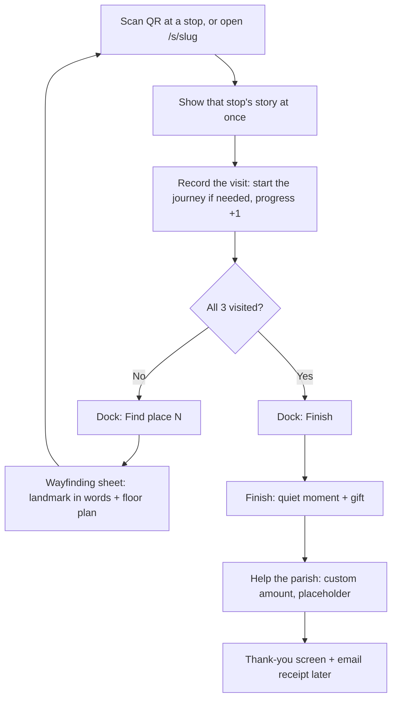

# Lakaw Katedral: MVP Product & Technical Spec

**Project:** Lakaw Katedral — gamified QR-guided tour web app
**Site:** The Metropolitan Cathedral and Parish of Saint John the Evangelist (Naga Metropolitan Cathedral), Naga City, Camarines Sur
**Version:** v0.1 (MVP draft) | **Date:** 2026-10-06 | **Owner:** Gab Reuyan

**Design (color, UX, screen inventory):** see [`DESIGN.md`](./DESIGN.md). Where UI details conflict, `DESIGN.md` wins.

---

## 1. Summary

A mobile web app that guides visitors through the cathedral on a fixed route of points of interest (POIs). Each POI has a QR code. Scanning it opens that stop's story, advances the visitor's journey, and shows where to go next on a simple map. The journey ends with an invitation to donate to the parish.

**MVP scope:** 3 POIs, no accounts, progress saved in the browser, works offline after the first scan.

## 2. Goals and non-goals

**Goals**
- Give pilgrims and domestic tourists a clear, meaningful walk through the cathedral.
- Make progress feel like a journey (figurative progression, not literal stamps).
- Work on low-end Android phones and on weak or no signal inside the church.
- Collect usage data to prove value to the parish.
- Leave a clean path to donations and, someday, native apps.

**Non-goals (MVP)**
- User accounts, logins, profiles, leaderboards
- Quizzes or tasks to unlock a stop
- Computer vision or AR recognition
- CMS or parish self-editing
- Multi-language (English only; Filipino later)
- Live payment processing (gateway comes later; see section 9)
- Native iOS or Android apps

## 3. Audience

- **Primary:** domestic tourists and pilgrims (Naga is the Pilgrim City)
- **Devices:** mostly mid to low-end Android, some iPhones
- **Context:** standing inside a church, possibly in a crowd, often with poor signal, sometimes older users

Design implications: big tap targets, high contrast, short text, readable in dim light, minimal steps.

### 3.1 Plain language

Visitor-facing copy uses plain words at about a **Grade 3 reading level**: short sentences (under about 12 words), common everyday words. Visitors may be children, older people, or reading English as a second language, and often read standing up in a crowd.

**Real names and key terms are never simplified.** Keep proper nouns and important terms exactly as they are: Naga Metropolitan Cathedral, Archdiocese of Cáceres, Saint John the Evangelist, Saint Peter Baptist, Raul Alcomendas, Cathedra, parish, nave, sanctuary, evangelization, dates and years, and other names from [`PILGRIM-GUIDE.md`](./PILGRIM-GUIDE.md). The first time a hard term appears, add a few simple words to explain it ("The Cathedra is the Archbishop's Chair."). Only the words *around* the names get simpler.

Word choices for everyday words (code and internal docs still say "POI", "stop", "journey"; only what visitors read changes):

| Instead of | Say |
|------------|-----|
| stop / POI | place ("Find place 2") |
| journey / tour | walk ("Start the walk") |
| donate, support | give, help ("Help the parish") |
| directions, navigate, progress | how to get there, see, steps so far |
| offline, connection | no internet, signal |

Rules: one idea per sentence; say what to do first ("Look up at the façade."); explain, don't replace, hard terms. Re-check new copy with a readability tool (Flesch-Kincaid grade 3 to 5 is fine when it includes names) and have a real child or older visitor read it aloud.

## 4. Journey and route

Fixed route, in order (from the parish pilgrim guide; see [`PILGRIM-GUIDE.md`](./PILGRIM-GUIDE.md)):

| # | POI | Placement of QR | URL |
|---|-----|-----------------|-----|
| 1 | The Cathedral Entrance | Main door, starting line | `/s/saints` |
| 2 | The Alcomendas Mural | Nave, at the Raul Alcomendas mural | `/s/mural` |
| 3 | The Cathedra | Near the Archbishop's Chair | `/s/cathedra` |
| End | Finish + Donate | Shown after POI 3 | `/finish` |

**URL design (consideration).** Stop URLs are short readable words, not random tokens, so a visitor can type one by hand if a code won't scan (glare, dim light, damaged sticker). Trade-offs, accepted for MVP:

- Anyone can open any stop by guessing its URL, so the QR is not a lock. This is fine because order is a suggestion (section 4.2), not a gate, and the content is public history.
- Codes never need reprinting for rotation, since the slugs are stable.
- If the parish later wants a real "you must be here" check, reintroduce random tokens (`/s/<token>`) behind the same `slug` field; nothing else in the flow depends on the URL being readable.

**Trial mode.** Until QR codes are printed, the wayfinding sheet shows a "Skip the scan" button that opens the next stop directly. It is controlled by `NEXT_PUBLIC_ALLOW_SKIP` (on by default; set to `false` to remove it).

### 4.1 Flow



Home (`/`) is a landing and resume hub. It is not a required step: scanning the entrance QR goes straight to stop 1.

### 4.2 Route rules

Order is a **suggestion, not a gate.** Every stop always shows its full story and counts toward completion. Reasons: with 3 stops a gate adds little, crowds and Mass make the exact route unpredictable, and progress can be lost when a QR opens in a different browser (see section 8). A forgiving rule means lost state is harmless.

1. **First visit to any stop:** show the story, mark it visited, set `startedAt` if this is the first visit. Scanning the entrance QR therefore *is* the start; there is no Start tap and no redirect.
2. **Visiting a stop out of the suggested order:** same as rule 1, plus a one-line note: "The suggested route goes to stop N next. Any order works."
3. **Re-visiting a stop:** show the story again; progress unchanged.
4. **Journey complete (all stops visited):** any scan shows the story plus a slim "You have completed the journey" banner linking to Finish.
5. **Next suggested stop:** the lowest-numbered unvisited stop. The dock action "Find place N" targets it.
6. **"Find place N" never opens the next story.** It opens the wayfinding sheet (landmark + map). The next story opens by scanning that stop's QR (or, in trial mode only, the Skip button).

## 5. Screens

Element-level inventory, chrome rules, and color tokens live in [`DESIGN.md`](./DESIGN.md). Summary:

1. **Home (`/`):** landing and resume hub (welcome, continue, or complete). Not required on site; the entrance QR skips it.
2. **Stop detail** (`/s/[slug]`): hero photo, title, short story, "Did you know?", bottom dock with the map button (progress ring) and one primary action: **Find place N** (or **Finish**).
3. **Wayfinding sheet (map):** next stop's title and a plain-words landmark, SVG floor plan (completed / here / next). Opens from the map button or "Find place N". Available anytime. Trial mode adds a "Skip the scan" button.
4. **Out-of-order note:** a one-line banner on a stop visited out of the suggested order. No blocking screen.
5. **Finish:** reward first (success check + thank-you), then a compact quiet closing moment, then **inline** Help the parish (custom amount only, no presets), with **Start over** below it. No stop checklist. No "Not now" button.
6. **Donate route:** redirects to Finish.
7. **Thank you:** thanks; receipt when gateway is live.
8. **Offline / error state:** tour readable after start; donate needs network.

## 6. Map

- Hand-drawn simplified SVG floor plan of the cathedral (nave, aisles, entrance, altar), not an architectural drawing.
- POI markers positioned by coordinates in the SVG's own coordinate space.
- States: completed, current ("You are here"), next (highlighted/pulsing), locked.
- No GPS. Indoor GPS is unreliable; location = last scanned POI.
- No Mapbox or Google Maps. If zooming is needed later, Leaflet with `CRS.Simple` over the SVG.

## 7. Content (hardcoded)

**Source of truth:** [`PILGRIM-GUIDE.md`](./PILGRIM-GUIDE.md), the parish pilgrim guide. MVP ships guide items **1–3** only. Items 4–16 stay in that document until a later release.

The text visitors read is the Grade 3 rewrite in `src/lib/tour/content.ts` (see 7.3). When the rewrite and the guide differ in tone, the guide wins on facts and names; the rewrite only simplifies the words around them.

### POI 1: The Cathedral Entrance
At the main door: St. John the Evangelist, Patron Saint of the Cathedral Parish, and St. Peter Baptist, Patron Saint of the Archdiocese of Cáceres. Ask them to walk with you, protect you, and lead you closer to Christ.

### POI 2: The Alcomendas Mural
The mural by Bicolano artist Raul Alcomendas. Through his work, discover Bicol's evangelization: the missionaries who came, the communities they served, and the generations who received and passed on the faith. You are part of a story that began centuries ago.

### POI 3: The Cathedra
The Cathedra (the Archbishop's Chair). It is more than a chair of honor. It symbolizes the Archbishop's teaching and pastoral authority and reminds us that the Cathedral is the mother church of the Archdiocese.

### 7.2 Landmarks (wayfinding copy)
Each stop has a one- or two-sentence `landmark` in plain words, shown in the wayfinding sheet under "Find place N". It tells the visitor where to look for the sign and QR code, since a map marker alone is not enough in a busy nave. Current lines are **placeholders** until the parish confirms where each QR sign will be mounted.

### 7.1 Content model

```ts
type Poi = {
  id: string;            // "saints"
  slug: string;          // readable URL segment, e.g. "mural" -> /s/mural
  order: number;         // 1..3
  title: string;
  shortTitle: string;    // one word for the floor plan label
  landmark: string;      // plain-words directions to this stop's sign / QR
  heroImage: string;     // compressed, e.g. /img/entrance.webp
  about: string;         // what is here (no instructions)
  action: string;        // dark-card call to action (pray, look, pause)
  fact: string;          // one interesting fact
  map: { x: number; y: number }; // SVG coords
};

type Tour = { id: string; version: number; pois: Poi[] };
```

Stored as typed JSON/MDX in the repo. Keep route rules and content in plain TypeScript (no Next.js-specific code) so a future Expo app can reuse them.

### 7.3 Visitor-facing wording

Titles name the place or object, not a verb invite: **The Cathedral Entrance**, **The Alcomendas Mural**, **The Cathedra**. (The pilgrim guide activity titles stay as written in [`PILGRIM-GUIDE.md`](./PILGRIM-GUIDE.md); the app uses place names for headlines.) Each stop reads in this order: **about** (what is here, no instructions), dark-card **action** (what to do: pray, look, pause), then one **interesting fact**. The copy in `src/lib/tour/content.ts` keeps every name and key term from the guide and uses short sentences with a plain-words explanation of each hard term (section 3.1). Because the wording is simplified for readers, the parish should verify the rewritten text against the guide. Landmark lines and every UI string follow the same rules.

## 8. Progress and state

- Stored in `localStorage` via a small Zustand store with `persist`.
- Shape: `{ tourId, tourVersion, startedAt, completed: string[], finishedAt?, donated? }`
- If `tourVersion` changes, migrate or reset gracefully.
- No personal data stored. Clearing browser data resets progress (acceptable for MVP).
- `localStorage` is the right fit for "no accounts": no login, no server, works offline. Its limit is that it is **per browser context**. A QR opened from the iPhone camera (Safari), Android Chrome, or an in-app scanner (Facebook, GCash, Maya) can land in a different context than the previous scan, which then starts with empty progress.
- We do not try to fix this with accounts or server sessions. Instead the route rules are forgiving (section 4.2): any scan shows its full story and counts, so a fresh context loses only the progress ring, not the experience. Not synced between devices.
- Possible later: a shareable "resume link" that carries visited stops in the URL hash, if analytics show many people losing progress.

## 9. Donations

- Custom amount only (no presets). PHP currency.
- Optional email field for a receipt.
- **Gateway: deferred.** Build behind a `PaymentProvider` interface (`createPayment(amount, email?) -> redirectUrl`) so any gateway can plug in later. MVP uses a stub that goes straight to the thank-you screen (or shows "coming soon").
- When live: payments must settle to the parish or diocese account, not a personal account.
- Thank-you screen and emailed receipt are low priority.
- Donation needs a connection; show a clear offline message if none.

## 10. Offline (PWA)

- Next.js PWA using **Serwist** (service worker).
- Precache happens when the service worker **installs** (first load of any page), not on a button tap. By the time a visitor reaches stop 2, every stop page, the map, fonts, JS/CSS, and hero images are already on the phone.
- Precached: `/`, `/map`, `/finish`, `/~offline`, every `/s/<slug>`, `.next/static` (JS, CSS, fonts), and `public/` (images, icons). Donation pages are not cached.
- Hero images are served unoptimized from `public/` (not `/_next/image`) so they can be precached by fixed URL.
- Precache still runs in the background; Home does not show a "saved on phone" status line.
- Target total tour payload under about 3 MB. Hero images and icons are WebP in `public/` (about 544 KB total).
- Not available in `next dev`; verify with `next build && next start`, then test in airplane mode.
- Strategy: cache-first for tour assets, network-only for donation.
- Web app manifest included so "Add to Home Screen" works, but installing is optional and not part of the flow.

## 11. Fullscreen

**Dropped from MVP.** Browsers require a user tap to enter fullscreen, and every QR scan leaves the page for the camera app, which exits fullscreen anyway. It cost the visitor an extra tap at the entrance for almost no benefit. The layout uses full height (`100dvh`, safe-area insets) instead. Revisit only if the app moves to an in-page scanner.

## 12. Analytics

**Tool: Umami** (cookieless, so no consent banner; tiny script; free self-host or free cloud tier; custom events and funnels).

Events:
| Event | Properties |
|-------|------------|
| `journey_start` | entry POI |
| `poi_view` | poi id, order, in_route (bool) |
| `poi_progress` | poi id, progress (1..3) |
| `out_of_order_scan` | visited poi, suggested poi |
| `map_open` | from poi |
| `journey_complete` | duration |
| `donate_view` / `donate_submit` | amount bucket (not exact), has_email |

Key funnel: `journey_start` -> POI 2 -> POI 3 -> `journey_complete` -> `donate_submit`.

## 13. Tech stack

| Layer | Choice | Why |
|-------|--------|-----|
| Framework | Next.js (App Router) + TypeScript | Mostly static, fast on cheap phones, easy hosting |
| Styling | Tailwind CSS | Fast iteration, small CSS |
| Offline | Serwist (Turbopack) | Maintained PWA/service-worker tooling for Next.js 16 |
| State | Zustand + persist (localStorage) | Tiny, simple |
| Map | Inline SVG | No indoor GPS needed; lightweight |
| Images | `next/image`, WebP/AVIF | Small payloads |
| Analytics | Umami | Cookieless, light, funnels |
| Hosting | Vercel | Static/edge, simple deploys |
| Payments | `PaymentProvider` interface, stub | Gateway TBD |

### Why not Flutter or Expo now
- **Flutter web:** large initial bundle and slow first load on low-end Android; weaker fit for a scan-and-go web experience.
- **Expo:** great for native later, but app-store installs at a church entrance kill adoption. A web link from the phone's camera is zero friction.
- **Future native path (someday):** Expo (React Native) reusing the shared TypeScript content and route-rule modules. Reasons to pivot: push notifications, app-store presence, or on-device CV/AR.

### Computer vision
Not in MVP. Dim lighting, crowds, battery, and model size make recognition unreliable on low-end phones, and QR codes already solve "where am I." If revisited: on-device MediaPipe image recognition with QR as fallback.

## 14. QR codes

- Each encodes `https://<domain>/s/<slug>` (for example `/s/mural`). Slugs are short words so they can also be typed by hand if a code won't scan; print the short URL under the QR.
- Printed with Lakaw Katedral branding plus a short instruction: "Scan with your camera to begin / continue the journey."
- Use high error correction (level Q or H); print at least 4 x 4 cm; matte finish to avoid glare.
- Placement agreed with the parish; respectful of liturgical spaces.
- Slugs are stable, so codes never need reprinting for rotation. Keep a slug-to-POI table with each sticker's physical location (used for the `landmark` copy).

## 15. Non-functional requirements

- First load on 4G under 3 s on a low-end Android; subsequent POIs instant (cached).
- Lighthouse performance 90+ on mobile.
- Accessible: WCAG AA contrast, large text option, alt text on images.
- Works on Android Chrome 100+ and iOS Safari 16+.
- No cookies, no personal data beyond optional receipt email.

## 16. Milestones

1. **Week 1:** content model, route rules, POI and map screens with placeholder content.
2. **Week 2:** PWA offline caching, progress persistence, wayfinding sheet.
3. **Week 3:** Umami events, finish and donate (stub) screens, QR generation, on-site test with 3 printed codes.
4. **Week 4:** parish content review, polish, launch.

## 17. Open items

- Parish to verify the Grade 3 rewrite in `content.ts` against [`PILGRIM-GUIDE.md`](./PILGRIM-GUIDE.md).
- Confirm exact QR placement for the Cathedra (POI 3) and finalize all `landmark` wayfinding lines (section 7.2).
- Before launch: set `NEXT_PUBLIC_ALLOW_SKIP=false` to remove the trial "Skip the scan" button.
- Donation step is a placeholder: the button reads "coming soon" but still shows the thank-you screen. Replace with a real gateway, or hide the form, before launch.
- Dedicated photos for each POI (permission to photograph); MVP reuses existing assets.
- Payment gateway and receiving account (deferred).
- Domain name.
- QR placement approval from the parish.
