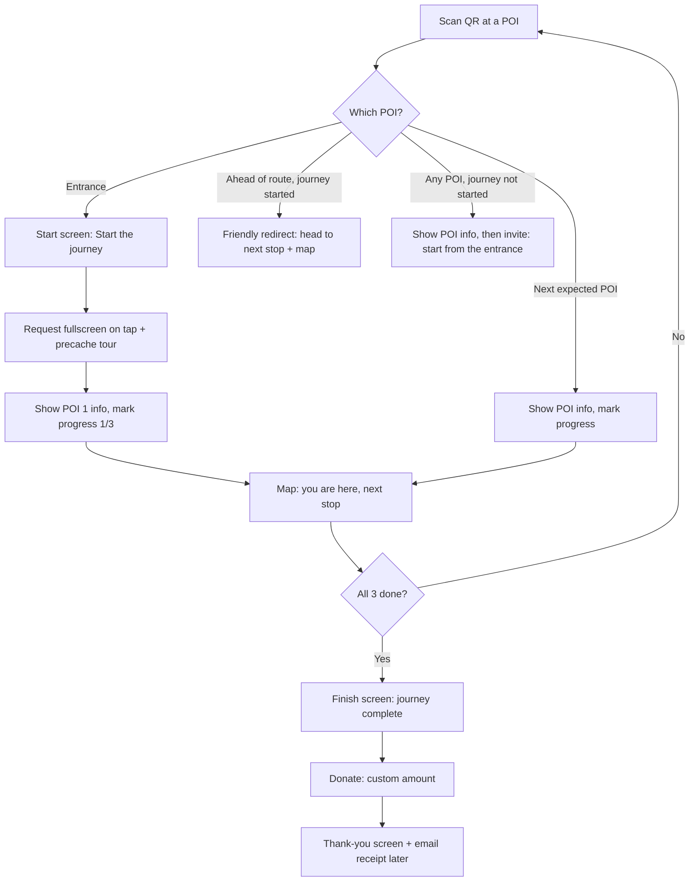

# Lakaw Katedral: MVP Product & Technical Spec

**Project:** Lakaw Katedral — gamified QR-guided tour web app
**Site:** The Metropolitan Cathedral and Parish of Saint John the Evangelist (Naga Metropolitan Cathedral), Naga City, Camarines Sur
**Version:** v0.1 (MVP draft) | **Date:** 2026-10-06 | **Owner:** Gab Reuyan

---

## 1. Summary

A mobile web app that guides visitors through the cathedral on a fixed route of points of interest (POIs). Each POI has a QR code. Scanning it opens that stop's story, advances the visitor's journey, and shows where to go next on a simple map. The journey ends with an invitation to donate to the parish.

**MVP scope:** 3 POIs, no accounts, progress saved in the browser, works offline after the first scan.

## 2. Goals and non-goals

**Goals**
- Give pilgrims and domestic tourists a clear, meaningful walk through the cathedral.
- Make progress feel like a journey (figurative progression, not literal stamps).
- Work on low-end Android phones and on weak or no signal inside the church.
- Collect usage data to prove value to the parish.
- Leave a clean path to donations and, someday, native apps.

**Non-goals (MVP)**
- User accounts, logins, profiles, leaderboards
- Quizzes or tasks to unlock a stop
- Computer vision or AR recognition
- CMS or parish self-editing
- Multi-language (English only; Filipino later)
- Live payment processing (gateway comes later; see section 9)
- Native iOS or Android apps

## 3. Audience

- **Primary:** domestic tourists and pilgrims (Naga is the Pilgrim City)
- **Devices:** mostly mid to low-end Android, some iPhones
- **Context:** standing inside a church, possibly in a crowd, often with poor signal, sometimes older users

Design implications: big tap targets, high contrast, short text, readable in dim light, minimal steps.

## 4. Journey and route

Fixed route, in order:

| # | POI | Placement of QR | Token URL (example) |
|---|-----|-----------------|---------------------|
| 1 | Entrance (Façade) | Main entrance, starting line | `/s/<random-token-1>` |
| 2 | Interior murals (trompe-l'oeil) | Nave, near a key column | `/s/<random-token-2>` |
| 3 | Statue (TBD, e.g. St. John the Evangelist) | Beside the statue | `/s/<random-token-3>` |
| End | Finish + Donate | Shown after POI 3 | `/finish` |

Tokens are random strings (e.g. `k7f2q`), not readable slugs, so visitors can't skip ahead by editing the URL.

### 4.1 Flow



### 4.2 Route rules

1. **Entrance scan (not started):** show the start screen with a "Start the journey" button, then POI 1 info. Progress = 1/3.
2. **Next expected POI:** show info and advance progress.
3. **Scanning a POI ahead of the route (journey started):** don't advance. Show "Head to <next stop> first" with the map highlighting it.
4. **Mid-route start (no journey yet, e.g. side door):** show that POI's info so the visitor still gets value, then a clear invite: "Want the full journey? Start at the entrance." with the map pointing to it. Progress does not advance.
5. **Re-scanning a completed POI:** show its info again; progress unchanged.
6. **After completion:** any scan shows the info plus a "You've completed the journey" banner with a link to donate.

## 5. Screens

1. **Start / Welcome** (entrance only): Lakaw Katedral brand, cathedral name, one-line intro, "Start the journey" button (triggers fullscreen and precache).
2. **POI detail:** title, hero photo, short story (about 80 to 150 words), "Did you know?" fact, progress indicator (e.g. 3 dots or a path line), "Show me where to go next" button.
3. **Map:** simple SVG floor plan with the route line, completed stops, current stop ("You are here" = last scanned POI), and next stop pulsing.
4. **Redirect / Invite:** used for rules 3 and 4.
5. **Finish:** journey-complete moment (subtle animation, not gamey), invitation to support the parish.
6. **Donate:** custom amount field (no presets), optional email for receipt, Donate button. Gateway stubbed in MVP.
7. **Thank you:** message of thanks; receipt sent by email once the gateway is live.
8. **Offline / error state:** friendly message if a needed asset or the donation step is unavailable offline.

## 6. Map

- Hand-drawn simplified SVG floor plan of the cathedral (nave, aisles, entrance, altar), not an architectural drawing.
- POI markers positioned by coordinates in the SVG's own coordinate space.
- States: completed, current ("You are here"), next (highlighted/pulsing), locked.
- No GPS. Indoor GPS is unreliable; location = last scanned POI.
- No Mapbox or Google Maps. If zooming is needed later, Leaflet with `CRS.Simple` over the SVG.

## 7. Content (hardcoded, draft)

All copy below is **draft from public sources and must be verified by the parish** before launch.

### POI 1: The Entrance and Façade
The Naga Metropolitan Cathedral is the seat of the Archdiocese of Cáceres, one of the oldest dioceses in the Philippines, created by papal bull on 14 August 1595. After fire destroyed an earlier church in 1768, construction of the present stone cathedral began in 1808 under Bishop Bernardo de la Concepción. It was completed and blessed in 1843. Look up: the squat façade, twin pilasters, and two short hexagonal belfries are typical of "Earthquake Baroque," built to survive the quakes that shaped this region.
*Did you know?* The façade carries the coat of arms of Castile and León.

### POI 2: The Interior Murals
Step into the nave and look at the columns, arches, and ceiling. The paintings use trompe-l'oeil, a technique that tricks the eye into seeing depth and carved detail on flat surfaces. The heavy arcades themselves were part of how the cathedral was strengthened after the 1820 earthquake.
*Did you know?* The cathedral was damaged by a typhoon in 1856 and an earthquake in 1887, and was restored each time. A major restoration began in 1987.

### POI 3: The Statue (TBD)
Placeholder. Confirm with the parish which statue to feature (a natural choice is the patron, St. John the Evangelist) and its location. Copy to be written once confirmed.

**Sources:** [Wikipedia: Naga Cathedral](https://en.wikipedia.org/wiki/Naga_Cathedral), [NHCP historical marker](http://nhcphistoricsites.blogspot.com/2011/10/church-of-naga.html), [City of Naga](https://www2.naga.gov.ph/the-cathedral-that-stood-the-test-of-time-naga-metropolitan-cathedral/), [TheOldChurches](https://www.theoldchurches.com/philippines/camarines-sur/naga-city/naga-city-metropolitan-cathedral/)

### 7.1 Content model

```ts
type Poi = {
  id: string;            // "entrance"
  token: string;         // random QR token, e.g. "k7f2q"
  order: number;         // 1..3
  title: string;
  heroImage: string;     // compressed, e.g. /img/entrance.webp
  body: string;          // short story (MDX or markdown)
  fact?: string;         // "Did you know?"
  map: { x: number; y: number }; // SVG coords
};

type Tour = { id: string; version: number; pois: Poi[] };
```

Stored as typed JSON/MDX in the repo. Keep route rules and content in plain TypeScript (no Next.js-specific code) so a future Expo app can reuse them.

## 8. Progress and state

- Stored in `localStorage` via a small Zustand store with `persist`.
- Shape: `{ tourId, tourVersion, startedAt, completed: string[], finishedAt?, donated? }`
- If `tourVersion` changes, migrate or reset gracefully.
- No personal data stored. Clearing browser data resets progress (acceptable for MVP).

## 9. Donations

- Custom amount input only, no presets. PHP currency.
- Optional email field for a receipt.
- **Gateway: deferred.** Build behind a `PaymentProvider` interface (`createPayment(amount, email?) -> redirectUrl`) so any gateway can plug in later. MVP uses a stub that goes straight to the thank-you screen (or shows "coming soon").
- When live: payments must settle to the parish or diocese account, not a personal account.
- Thank-you screen and emailed receipt are low priority.
- Donation needs a connection; show a clear offline message if none.

## 10. Offline (PWA)

- Next.js PWA using **Serwist** (service worker).
- On the entrance scan / "Start the journey" tap, precache all POI pages, images, the map SVG, and fonts.
- Target total tour payload under about 3 MB.
- Strategy: cache-first for tour assets, network-only for donation.
- Web app manifest included so "Add to Home Screen" works, but installing is optional and not part of the flow.

## 11. Fullscreen

- Browsers block automatic fullscreen; it needs a user tap.
- "Start the journey" calls the Fullscreen API (`document.documentElement.requestFullscreen()`), wrapped in feature detection.
- Android Chrome: supported. iPhone Safari: not supported for pages, so fall back to a full-height layout (`100dvh`, safe-area insets, no scroll chrome).
- If the user exits fullscreen, don't nag; offer a small "Fullscreen" icon on Android only.

## 12. Analytics

**Tool: Umami** (cookieless, so no consent banner; tiny script; free self-host or free cloud tier; custom events and funnels).

Events:
| Event | Properties |
|-------|------------|
| `journey_start` | entry POI |
| `poi_view` | poi id, order, in_route (bool) |
| `poi_progress` | poi id, progress (1..3) |
| `out_of_order_scan` | scanned poi, expected poi |
| `midroute_invite_shown` / `midroute_invite_accepted` | poi id |
| `map_open` | from poi |
| `journey_complete` | duration |
| `donate_view` / `donate_submit` | amount bucket (not exact), has_email |
| `fullscreen_entered` | platform |

Key funnel: `journey_start` -> POI 2 -> POI 3 -> `journey_complete` -> `donate_submit`.

## 13. Tech stack

| Layer | Choice | Why |
|-------|--------|-----|
| Framework | Next.js (App Router) + TypeScript | Mostly static, fast on cheap phones, easy hosting |
| Styling | Tailwind CSS | Fast iteration, small CSS |
| Offline | Serwist | Maintained PWA/service-worker tooling for Next.js |
| State | Zustand + persist (localStorage) | Tiny, simple |
| Map | Inline SVG | No indoor GPS needed; lightweight |
| Images | `next/image`, WebP/AVIF | Small payloads |
| Analytics | Umami | Cookieless, light, funnels |
| Hosting | Vercel | Static/edge, simple deploys |
| Payments | `PaymentProvider` interface, stub | Gateway TBD |

### Why not Flutter or Expo now
- **Flutter web:** large initial bundle and slow first load on low-end Android; weaker fit for a scan-and-go web experience.
- **Expo:** great for native later, but app-store installs at a church entrance kill adoption. A web link from the phone's camera is zero friction.
- **Future native path (someday):** Expo (React Native) reusing the shared TypeScript content and route-rule modules. Reasons to pivot: push notifications, app-store presence, or on-device CV/AR.

### Computer vision
Not in MVP. Dim lighting, crowds, battery, and model size make recognition unreliable on low-end phones, and QR codes already solve "where am I." If revisited: on-device MediaPipe image recognition with QR as fallback.

## 14. QR codes

- Each encodes `https://<domain>/s/<token>`.
- Printed with Lakaw Katedral branding plus a short instruction: "Scan with your camera to begin / continue the journey."
- Use high error correction (level Q or H); print at least 4 x 4 cm; matte finish to avoid glare.
- Placement agreed with the parish; respectful of liturgical spaces.
- Keep a token-to-POI table so codes can be reprinted or rotated.

## 15. Non-functional requirements

- First load on 4G under 3 s on a low-end Android; subsequent POIs instant (cached).
- Lighthouse performance 90+ on mobile.
- Accessible: WCAG AA contrast, large text option, alt text on images.
- Works on Android Chrome 100+ and iOS Safari 16+.
- No cookies, no personal data beyond optional receipt email.

## 16. Milestones

1. **Week 1:** content model, route rules, POI and map screens with placeholder content.
2. **Week 2:** PWA offline caching, fullscreen, progress persistence, redirect and invite flows.
3. **Week 3:** Umami events, finish and donate (stub) screens, QR generation, on-site test with 3 printed codes.
4. **Week 4:** parish content review, polish, launch.

## 17. Open items

- Parish to verify all historical copy.
- Choose and locate the statue for POI 3.
- Photos for each POI (permission to photograph).
- Payment gateway and receiving account (deferred).
- Domain name.
- QR placement approval from the parish.
